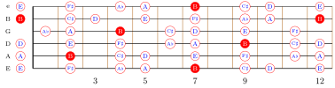

<!--
README.md
fretplot v0.0.3
Copyright 2025-- Soumendra Ganguly

This work may be distributed and/or modified under the
conditions of the LaTeX Project Public License, either version 1.3
of this license or (at your option) any later version.
The latest version of this license is in
  https://www.latex-project.org/lppl.txt
and version 1.3c or later is part of all distributions of LaTeX
version 2008 or later.

This work has the LPPL maintenance status `author-maintained'.

The Current Maintainer of this work is Soumendra Ganguly.

This work consists of the files fretplot.sty, fretplot.lua,
doc_fretplot.tex, doc_fretplot.pdf, README.md, and LICENSE.
-->

# The `fretplot` package

**Author and maintainer:** [Soumendra Ganguly](https://soumendraganguly.com)  
**Copyright 2025– Soumendra Ganguly**

---

The **fretplot** LuaTeX package provides batch generation of scale and chord diagrams for plucked string instruments, such as the guitar.

- **Flexible & Automated:**  
  Highly customizable and automatable via simple, powerful file formats for describing fretboard diagrams. Easily generate batches of diagrams.

- **Attractive Defaults:**  
  Comes with sensible, visually appealing default settings.

- **Music Theory Aware:**  
  Includes easy-to-use LaTeX macros that understand music theory. Render guitar scale diagrams by specifying the musical scale or scale type via built in macros or directly via degree, pitch class, or interval formulae.

---

📖 [Read the documentation for more information](doc_fretplot.pdf)
